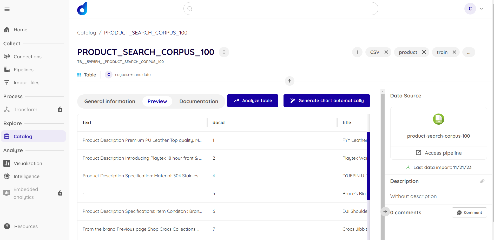
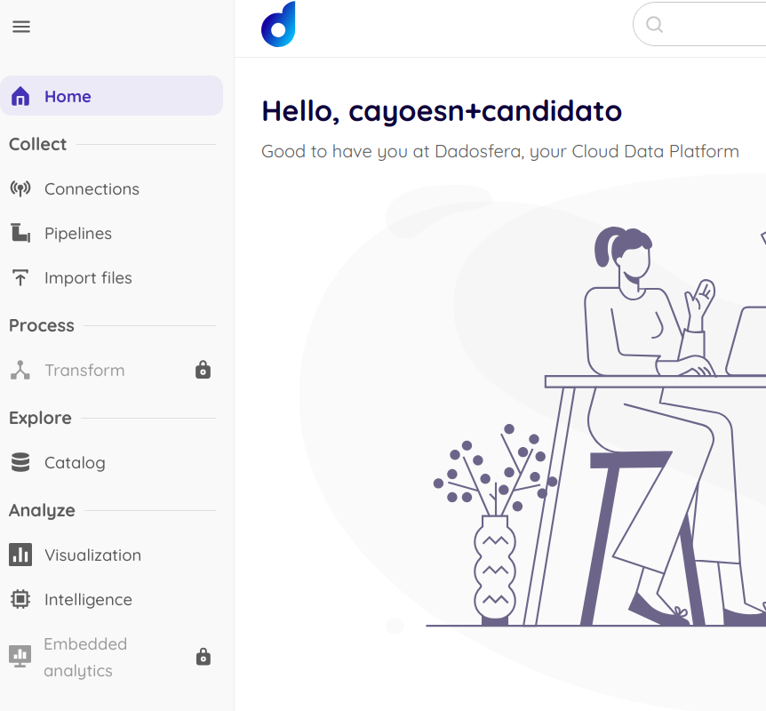
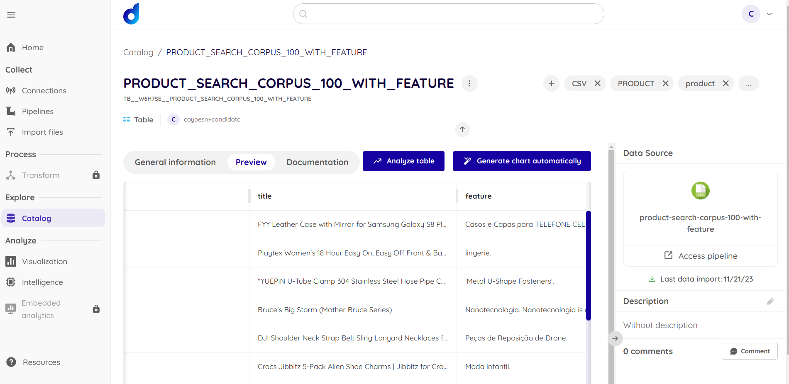
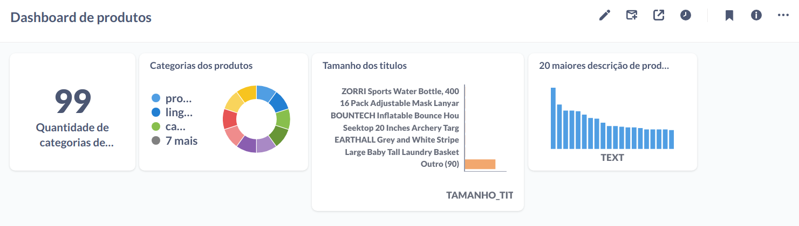
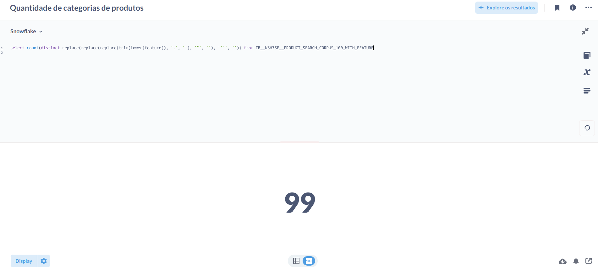
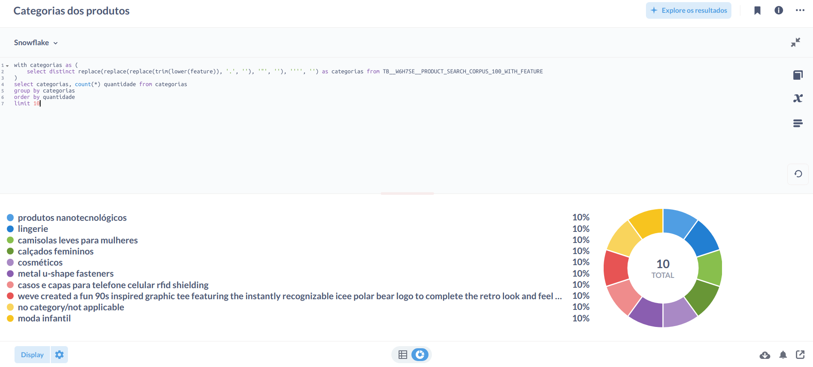
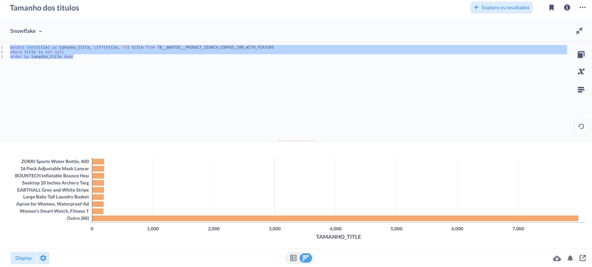
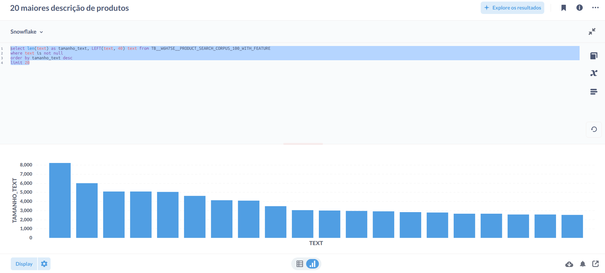
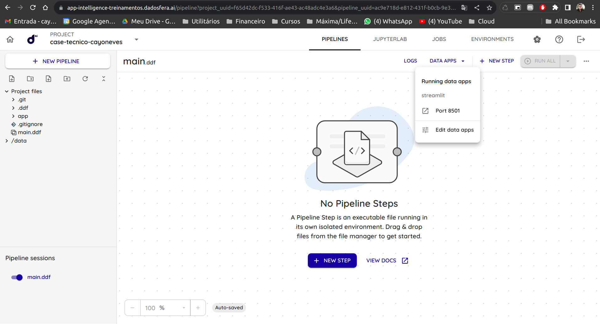
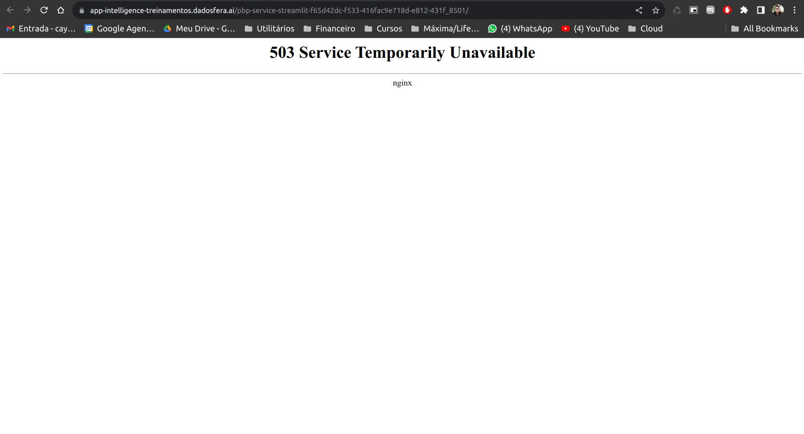

# CAYO_NEVES_DDF_DATAANALYST_112023

## Item 1 - Sobre Storytelling e Apresentação

- Não concluído

## Item 2 - Sobre a Dadosfera

- Foi coletado os dados da api product-search-corpus com o Notebook: [Notebook de download do dataset](dataset.ipynb)

- Foi importado o arquivo product-search-corpus-100.csv manual que resultou na criação da tabela PRODUCT_SEARCH_CORPUS_100(TB__59P5FH__PRODUCT_SEARCH_CORPUS_100).



- Foi importada e catalogada seguindo a documentação da Dadosfera (https://docs.dadosfera.ai/docs/coletando-o-dado e https://docs.dadosfera.ai/docs/acessando-a-tabela-no-cat%C3%A1logo)

## Item 3 - Sobre GenAI e LLMs

- Como não tinha acesso ao módulo de Transformação que eu acredito ser o melhor para realizar essa transformação, fiz a transformação utilizando o LLM com ChatGPT em um notebook.



- Foi utilizado o LLM com ChatGPT para enriquerecer os dados criando um coluna de 'feature' com base nas descrições dos produtos, e gerando o arquivo csv product-search-corpus-100-with-feature atrás do código: [Notebook de LLM com ChatGPT](llm-chatgpt.ipynb)

- Foi importado o arquivo product-search-corpus-100-with-feature.csv manual que resultou na criação da tabela PRODUCT_SEARCH_CORPUS_100_WITH_FEATURE(TB__W6H7SE__PRODUCT_SEARCH_CORPUS_100_WITH_FEATURE).



## Item 4 - Sobre SQL e Python

- Foi criado um dashboard de maneira superficial para mostrar a utilização de SQL com a plataforma de visualização de dados.



- Foi criado 4 itens no dashboard: Quantidade de categorias de produtos, Divisão da quantidade de categorias por produtos, Produtos com maiores título e 20 maiores descrições de produtos.

- 1. Quantidade de categorias de produtos

```sql
select count(distinct replace(replace(replace(trim(lower(feature)), '.', ''), '"', ''), '''', '')) from TB__W6H7SE__PRODUCT_SEARCH_CORPUS_100_WITH_FEATURE
```



- 2. Gráfico de pizza do número de produtos por categoria

```sql
with categorias as (
    select distinct replace(replace(replace(trim(lower(feature)), '.', ''), '"', ''), '''', '') as categorias from TB__W6H7SE__PRODUCT_SEARCH_CORPUS_100_WITH_FEATURE
)
select categorias, count(*) quantidade from categorias 
group by categorias
order by quantidade
limit 10
```



- 3. Gráfico de linhas com os maiores títulos de produtos

```sql
select len(title) as tamanho_title, LEFT(title, 30) title from TB__W6H7SE__PRODUCT_SEARCH_CORPUS_100_WITH_FEATURE
where title is not null
order by tamanho_title desc
```



- 4. 20 maiores descrições de produtos

```sql
select len(text) as tamanho_text, LEFT(text, 40) text from TB__W6H7SE__PRODUCT_SEARCH_CORPUS_100_WITH_FEATURE
where text is not null
order by tamanho_text desc
limit 20
```



## Item 5 - Sobre Data Apps

- No desenvolvimento do DataApp, foi utilizado o projeto de exemplo e o tutorial da Dadosfera (https://docs.dadosfera.ai/docs/data-app-com-streamlit), mas seguindo os passos da documentação não foi possível visualizar o DataApp devido ao erro abaixo:






## Item Bonus - Sobre GenAI + Data Apps

- Não concluído (devido ao erro do Item 5)